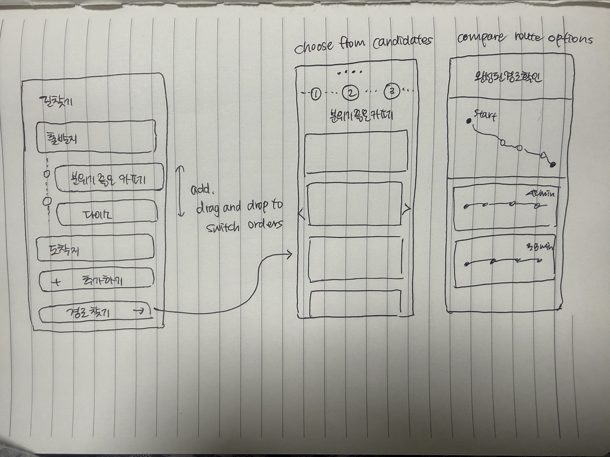

# Pitch

## Problem

대중교통으로 이동하면서 식사나 쇼핑 같은 일을 처리할 때, 최대한 적게 걷고 싶다. 하지만 지금은 여러 장소와 대중교통 경로를 따로 검색하면서, 어느 곳이 정류장이나 역에서 가깝고 전체 이동에 편한지 직접 비교해야 한다.

## Who else?

다른 사용자들도 지도 앱의 추천 경로가 원하는 이동 방식과 맞지 않으면 역이나 정류장을 바꿔가며 여러 번 검색한다. 이동 중 처리할 일이 있으면 경로 주변의 장소를 따로 찾고, 어느 곳을 들르는 것이 편한지 직접 비교한다.

## Existing solutions

카카오맵과 네이버지도는 대중교통 길찾기를 제공하지만, 대중교통 경로에 경유지를 추가할 수 없다. 이동 중 들를 곳이 있으면 장소를 따로 검색하고, 각 후보가 전체 동선에 맞는지 직접 비교해야 한다.

  
  

<em>과거 카카오맵 카나나를 활용하려고 했으나 실패한 기록</em>

## Solution

해야 할 일이나 가고 싶은 장소 종류를 입력하면, 버스·지하철을 활용해 걷는 거리를 줄일 수 있는 장소와 경로를 함께 추천한다.

## No-gos

1) 서울 외 지역은 지원하지 않는다. 
2) 로그인 기능은 구현하지 않는다. 
3) 장소 자체의 인기를 고려하기 보단, 내 이동에 맞는 장소를 고르는 것을 우선시한다.
4) 대중교통 중 버스, 지하철만 지원한다.
